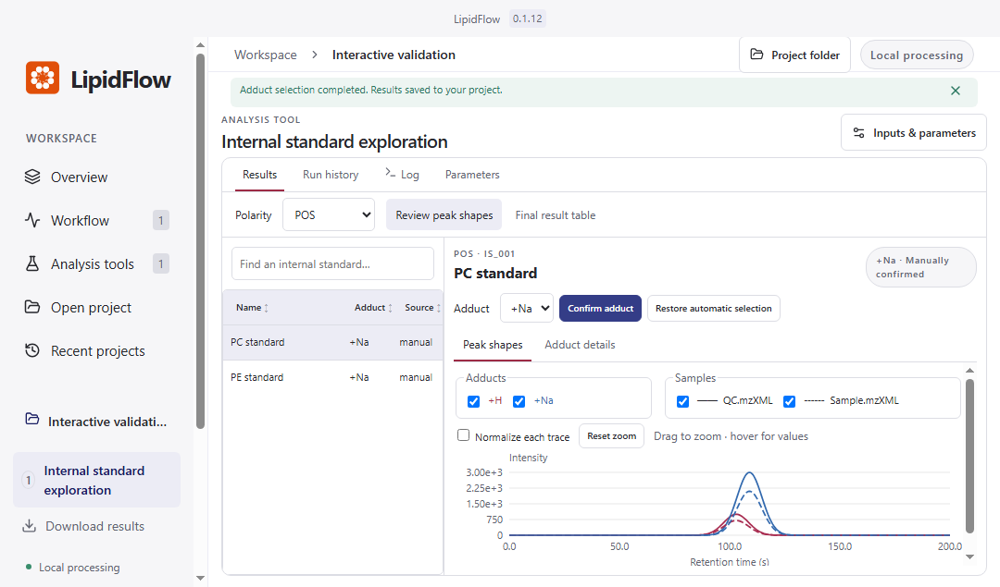
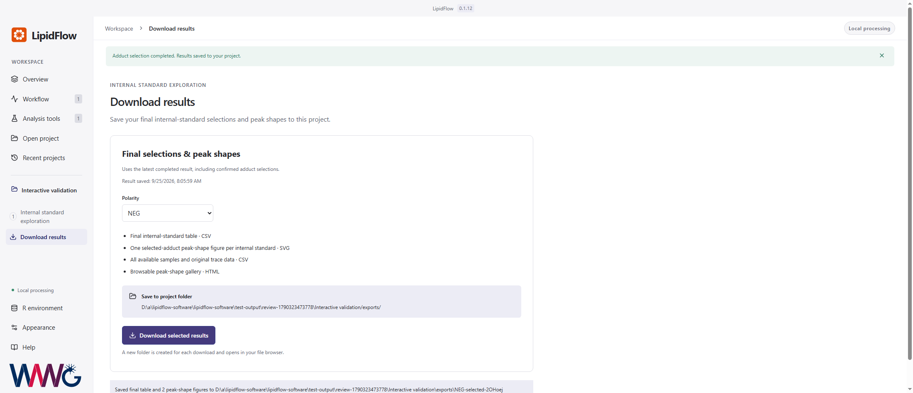

# Windows 0.1.12 acceptance record

Validated on 2026-09-25 using Windows Server 2022 x64 (GitHub-hosted runner).

- Tested source: `153ebe995734281e61e3d3af6f80936edc82d8db`.
- [Successful build and full logs](https://github.com/tidymass/lipidflow-software/actions/runs/36108263384), total duration 33m 35s.
- [Windows installer artifact](https://github.com/tidymass/lipidflow-software/actions/runs/36108263384/artifacts/10853362055): `LipidFlow-0.1.12-windows-x64-setup.exe` and its SHA256 file; approximately 1.02 GB compressed.
- [Test evidence artifact](https://github.com/tidymass/lipidflow-software/actions/runs/36108263384/artifacts/10852892812): runtime manifests, analysis logs and screenshots.

These are GitHub Actions artifacts and require repository access. They are subject to GitHub artifact retention. The installer is unsigned. No Windows 10/11 physical-machine or ARM64 validation is claimed.

## Passed checks

| Area | Evidence |
| --- | --- |
| Core project guards | Nine Node tests passed |
| Windows runtime | R 4.5.2; all 376 locked extension-package versions match; 218 native Windows binaries recorded |
| Build and installation | Production build and NSIS x64 packaging passed; installed into a directory containing spaces and Chinese characters |
| Installed R engine | Import, known-ratio quantification, export and package loading passed using installed resources |
| Real POS raw files | QC extraction, manual selection, QC-only compatibility and four-file peak-picking workflow passed |
| Annotation | Two reference-derived queries matched the installed bundled reference database |
| Desktop | Navigation, project creation/reopening, analysis results and theme tests passed |
| Internal-standard review | Sorting, trace filters, hover, zoom, consecutive manual confirmation, polarity preservation, reopening and restoring automatic selection passed |
| Compact layout | Complete chart and confirmation controls remain within content areas of 1080×635, 1080×700, 1440×900 and 2200×950 |
| Downloads | POS and NEG exports contain the latest final CSV, selected-adduct SVGs, trace CSVs and HTML gallery; persisted manual choice is retained |

See [test-data provenance](test-data.md). The interaction screenshots below use generated test curves, including synthetic NEG labels. They do not represent experimental data or scientific NEG validation. The inherited mzR/Rcpp build-version warning remains; raw reading and analysis tests passed.

## Actual Windows screenshots

Minimum content height, including the success banner:

Independent download page:

